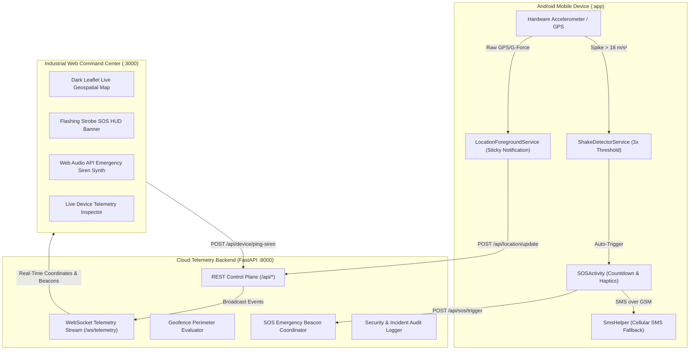

# 🛡️ AegisSafe — Industrial Family Safety Ecosystem

> **Next-Generation Real-Time Family Safety, Telemetry, and Emergency Distress Coordination System.**

---

## 📸 System Overview & UI Walkthrough

### 1. Web Command Center & Live Geospatial Map (`http://localhost:3000`)
* **Real-time Map & Telemetry**: Live member pins in Colombo with battery status, current movement velocity, and safe zone perimeter indicators.
* **Instant Incident Log & Audits**: Real-time websocket stream capturing distress beacons, safe zone transitions, and charging events.
* **Emergency Remote Controls**: Guardian-triggered high-decibel siren and live video verification dispatch.

---

### 2. Native Android Mobile Client & SOS Protocol (`:app`)
* **Instant SOS Panic Trigger**: Large haptic-feedback emergency activator with hardware Shake-to-SOS sensor monitoring.
* **5-Second Countdown HUD**: Fail-safe cancelation window preventing accidental alerts, accompanied by continuous strobe haptics.
* **Dual Emergency Dispatch**: Concurrent WebSockets cloud transmission and zero-data GSM SMS broadcast with direct Google Maps coordinates.

---

## 🏗️ System Architecture & Data Flow



---

## 🚀 Getting Started & How to Run

### 1. Cloud Telemetry Backend (FastAPI)
```powershell
cd backend
python -m uvicorn main:app --reload --host 0.0.0.0 --port 8000
```
* **Interactive API Docs (Swagger UI)**: [http://localhost:8000/docs](http://localhost:8000/docs)
* **Health Check**: [http://localhost:8000/api/health](http://localhost:8000/api/health)

---

### 2. Web Command Center (Frontend)
```powershell
python -m http.server 3000 --directory frontend
```
* **Live Command Center**: [http://localhost:3000](http://localhost:3000)

---

### 3. Native Android Mobile App (`:app`)
1. Open **Android Studio**.
2. Select `d:\AndroidStudioProjects\FamilySafetyApp`.
3. Choose your target **Android Emulator** or physical device.
4. Click **Run (▶)** (`Shift + F10`).

---

## 📡 Core API Reference

| Endpoint | Method | Description |
| :--- | :---: | :--- |
| `/api/health` | `GET` | Service health, active circles, and DB status |
| `/api/sos/trigger` | `POST` | Trigger emergency distress beacon |
| `/api/sos/cancel` | `POST` | Resolve and cancel active distress beacon |
| `/api/location/update` | `POST` | Sync mobile GPS coordinates & battery telemetry |
| `/api/device/ping-siren` | `POST` | Guardian remote audio alarm locator |
| `/ws/telemetry` | `WS` | Real-time bi-directional telemetry websocket stream |

---

## 🛡️ Key Features
- **Zero-Data Fallback**: Automatic SMS broadcast with live Google Maps coordinate links when network data drops.
- **Shake-to-SOS Detection**: Hardware accelerometer threshold trigger for covert distress dispatch.
- **Geofence Safe Zones**: Real-time entry/exit perimeter notifications for school, home, and custom safe areas.
- **Persistent Telemetry**: Battery-optimized foreground service ensuring continuous location tracking in background state.
