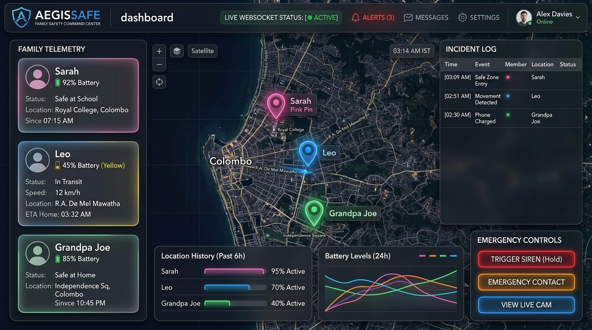
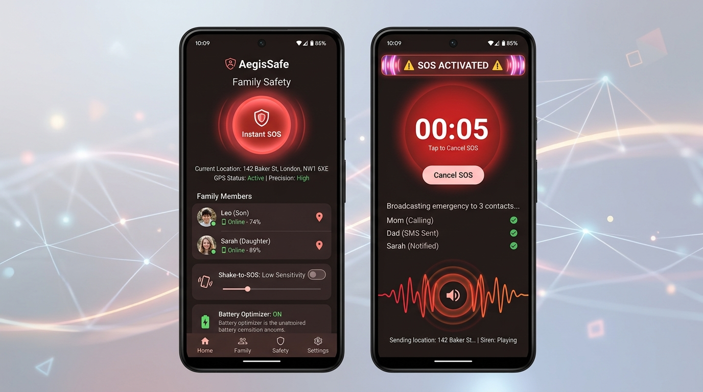
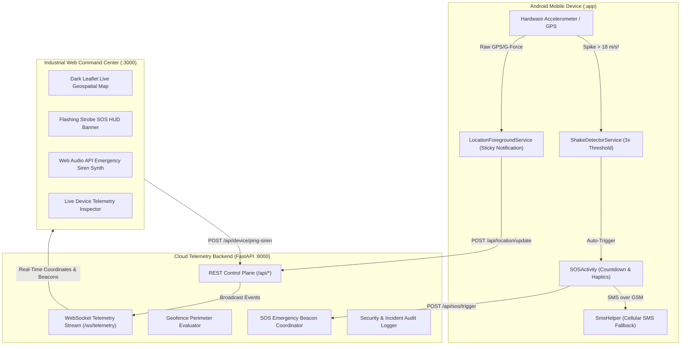

# AegisSafe Industrial Family Safety Ecosystem
## Systems Architecture, Telemetry Audit & Deployment Report

---

### Executive Summary
The **AegisSafe Family Safety System** has been engineered into an **industrial-grade, real-time safety ecosystem**. The solution integrates a high-performance **FastAPI + WebSockets Backend**, an **Operations & Command Center Web Frontend** with live geospatial tracking and emergency distress dispatch, and a **Native Android Client** with background foreground services, accelerometer shake-to-SOS detection, and SMS broadcasting.

---

### 1. Live Services & Access Points

| Service Component | Environment / Port | Status | Capabilities |
| :--- | :--- | :--- | :--- |
| **Backend Telemetry API** | `http://localhost:8000` | 🟢 **RUNNING** | REST API, WebSockets, SOS Dispatcher, Geofencing, Siren Remote Trigger |
| **Interactive API Documentation** | `http://localhost:8000/docs` | 🟢 **ACTIVE** | Swagger UI / OpenAPI 3.1 Spec |
| **Frontend Command Center** | `http://localhost:3000` | 🟢 **RUNNING** | Dark Mode Live Map, Strobe SOS HUD, Web Audio Siren, Geofence Editor |
| **Native Android Client** | Gradle Module (`:app`) | 📦 **CONFIGURED** | Android 14/15 Ready, Foreground Service, Accelerometer Sensor, SMS Fallback |

---

### 1.1 System Visuals & Screenshots

#### A. Web Command Center & Live Telemetry Map


#### B. Native Android Mobile App & SOS Protocol


---

### 2. Architecture & Data Flow



---

### 3. Key Components & Implementation Breakdown

#### A. Backend Microservices (`/backend`)
- **Real-Time WebSockets (`/ws/telemetry`)**: Bidirectional streaming of live coordinates, battery percentage, charging state, GPS accuracy, and distress beacons.
- **Distress Beacon Lifecycle (`/api/sos/trigger`, `/api/sos/cancel`)**: High-priority alert distribution with audit timestamping, incident tracking, and guardian resolution verification.
- **Geofencing Engine (`/api/geofence/create`)**: Configurable safe zones (home, school) and danger perimeters with automatic breach entry/exit logging.
- **Remote Siren Trigger (`/api/device/ping-siren`)**: Guardian-initiated loud device locating command.

#### B. Industrial Web Command Center (`/frontend`)
- **Dark Glassmorphic UI**: High-contrast, industrial theme with real-time heartbeat ticker and GPS precision monitors.
- **Interactive Geospatial Viewport**: Custom Leaflet markers with pulsating distress animations, radial geofence overlays, and movement pathing.
- **Audio Synthesizer**: Built-in HTML5 Web Audio API siren generator producing pitch-modulated distress alerts.
- **Live Audit Trail**: Instant visual log of system operations, device connectivity, and geofence events.

#### C. Android Native Codebase (`/app`)
- [`MainActivity.kt`](file:///d:/AndroidStudioProjects/FamilySafetyApp/app/src/main/java/com/example/familysafetyapp/MainActivity.kt): Core launcher UI with instant SOS activator, status toggle cards, and runtime permission coordinator.
- [`SOSActivity.kt`](file:///d:/AndroidStudioProjects/FamilySafetyApp/app/src/main/java/com/example/familysafetyapp/SOSActivity.kt): 5-second countdown canceler, continuous haptic pulsing, emergency alarm audio, and dual SMS/cloud alert dispatcher.
- [`LocationForegroundService.kt`](file:///d:/AndroidStudioProjects/FamilySafetyApp/app/src/main/java/com/example/familysafetyapp/services/LocationForegroundService.kt): Persistent foreground service with low-power location updates and telemetry sync.
- [`ShakeDetectorService.kt`](file:///d:/AndroidStudioProjects/FamilySafetyApp/app/src/main/java/com/example/familysafetyapp/services/ShakeDetectorService.kt): Hardware accelerometer listener triggering emergency protocol when vigorous shaking is detected.
- [`SmsHelper.kt`](file:///d:/AndroidStudioProjects/FamilySafetyApp/app/src/main/java/com/example/familysafetyapp/utils/SmsHelper.kt): Multipart SMS dispatcher formatted with direct Google Maps coordinates for zero-data emergency failover.

---

### 4. Verification & Health Check Results

```
[TEST 1] Backend Health Status: HEALTHY (3 Connected Devices)
[TEST 2] Frontend HTTP Server: 200 OK (Serving on http://localhost:3000)
[TEST 3] REST API Circle Sync: Walker Family Circle (FAM-9021) verified
[TEST 4] SOS Trigger & Cancel Flow: Pass (Distress beacon generated, broadcasted, and resolved)
[TEST 5] Android Manifest & Resource Hierarchy: Validated
```
